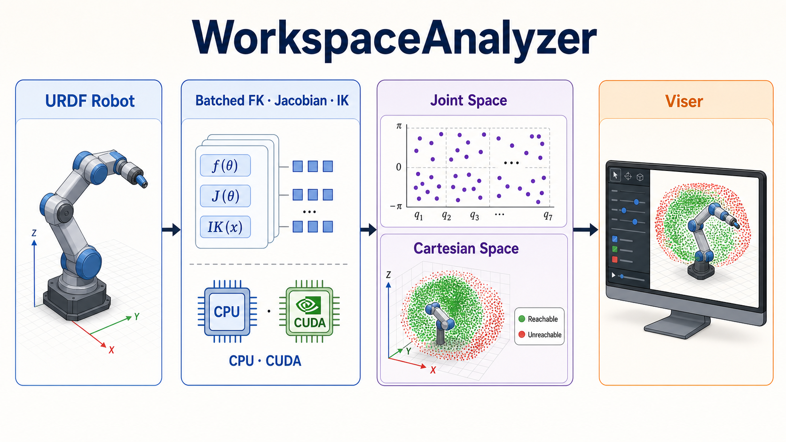

# WorkspaceAnalyzer

[English](README.md) | [简体中文](README.zh-CN.md)



WorkspaceAnalyzer is a simulator-independent Python toolkit for robot workspace analysis. It builds a general serial-chain solver directly from URDF, provides batched FK, geometric Jacobian, and numerical IK on NumPy or PyTorch, and renders robot geometry and reachability results with Viser.

The project separates robot models, compute backends, analysis, and visualization. Its core package depends only on NumPy and does not require EmbodiChain, Isaac Lab, ROS, or a specific robot wrapper.

## Features

- Automatic URDF root, tip, active-joint, fixed-transform, axis, and limit handling.
- One batched API for NumPy CPU and PyTorch CPU/CUDA.
- Forward kinematics, analytic geometric Jacobians, and bounded damped-least-squares IK.
- Parallel multi-start IK with per-target best-solution selection.
- Joint-space analysis: sample joints and map them to Cartesian space with FK.
- Cartesian-space analysis: sample XYZ targets and classify them with batched IK.
- Random, grid, Gaussian, Halton, Sobol, and Latin-hypercube sampling.
- Translational manipulability metrics.
- Viser support for URDF meshes and primitives, live joint controls, skeletons, TCP frames, and workspace clouds.
- Minimal dependencies with optional extras for Torch, Viser, and SciPy.

## Requirements

- Python 3.10 or newer
- NumPy 1.24 or newer
- Optional: PyTorch 2.1+, SciPy 1.10+, Viser, and trimesh

CUDA availability is controlled by the installed PyTorch build. This project intentionally does not pin a CUDA wheel; install the PyTorch build appropriate for the target driver before installing the Torch extra.

## Installation

```bash
# NumPy-only core
python -m pip install -e .

# Choose only the capabilities you need
python -m pip install -e '.[torch]'
python -m pip install -e '.[viser]'
python -m pip install -e '.[sampling]'

# Complete runtime and development environment
python -m pip install -e '.[all,dev]'
```

## Quick start

### Construct a solver

```python
from workspace_analyzer import create_solver

solver = create_solver(
    "robot.urdf",
    base_link="base_link",  # optional for a single-root URDF
    tip_link="tool0",       # optional; defaults to the longest active chain
    backend="torch",        # auto, numpy, or torch
    device="cuda",          # auto, cpu, cuda, or cuda:1
    dtype="float32",
)

poses = solver.forward(q_batch)                 # (N, 4, 4)
jacobians = solver.jacobian(q_batch)            # (N, 6, DoF)
ik = solver.inverse(target_poses, seed=q_seed)
robust_ik = solver.inverse(target_poses, restarts=4)

if not bool(ik.success.all()):
    print("Some IK targets did not converge", ik.residual)
```

Use `position_only=True` for position reachability or robots with fewer than six task-space degrees of freedom. Multi-start IK combines all seeds into one batch and selects the lowest-residual result for each target. For real-time tracking, using the previous joint state as `seed` is usually faster than random restarts.

### Joint-space workspace analysis

```python
from workspace_analyzer import WorkspaceAnalyzer, WorkspaceConfig

result = WorkspaceAnalyzer(solver, WorkspaceConfig()).analyze()
result.save("workspace.npz")
```

This mode follows `joint samples -> FK -> Cartesian points`. When enabled, the analyzer also computes a translational manipulability score for each point.

### Cartesian-space reachability analysis

```python
import numpy as np
from workspace_analyzer import CartesianConfig, SamplingConfig, WorkspaceAnalyzer

config = CartesianConfig(
    bounds=np.array([
        [-0.7, 0.7],   # x min/max
        [-0.3, 0.9],   # y min/max
        [0.4, 1.8],    # z min/max
    ]),
    sampling=SamplingConfig(num_samples=20_000, batch_size=1024),
    position_only=True,
    restarts=4,
    reference_joints=q_reference,
    reference_pose=solver.forward(q_reference),
)
result = WorkspaceAnalyzer(solver).analyze_cartesian(config)
print(result.metadata["success_rate"])
result.save("cartesian_reachability.npz")
```

This mode follows `XYZ targets -> IK -> reachable/unreachable classification`. Results contain all query points, best joint solutions, Boolean reachability flags, and IK residuals.

## Command-line interface

The package CLI runs joint-space analysis:

```bash
workspace-analyzer robot.urdf \
  --base-link base_link --tip-link tool0 \
  --backend torch --device cuda \
  --strategy sobol --samples 100000 --batch-size 8192 \
  --output workspace.npz --viser --port 8080
```

Use the Marvin example below for the Cartesian workflow. A browser-based Viser client can be opened at the URL printed by the process; no desktop display server is required.

## Viser visualization

The viewer supports:

- URDF mesh, box, cylinder, and sphere visuals.
- Visual origins, RPY transforms, mesh scaling, and GLB materials.
- Live per-joint sliders and a reset action.
- Independent visibility for robot geometry, skeleton, joints, TCP, and workspace.
- Manipulability coloring for FK workspaces.
- Green/red reachable/unreachable coloring for Cartesian analysis.
- Deterministic display-only downsampling above 250,000 points.

```python
from workspace_analyzer.visualization import ViserWorkspace

viewer = ViserWorkspace(solver, port=8080)
viewer.add_workspace(result)
viewer.wait()
```

## Marvin M6 single-arm example

The examples default to this external asset:

```text
/home/ubuntu/workspace/chase/HumanoidAssets/Marvin_M6_S_CCS_696_V4.0/robot.urdf
```

Override it with `--urdf` on another machine. The selected chain includes fixed torso transforms while sampling only the seven joints of one arm.

Joint-space analysis:

```bash
PYTHONPATH=src python examples/marvin_single_arm.py \
  --mode joint --arm left --backend torch --device auto \
  --samples 100000 --batch-size 8192 --viser
```

Cartesian position reachability:

```bash
PYTHONPATH=src python examples/marvin_single_arm.py \
  --mode cartesian --arm left --backend torch --device auto \
  --samples 20000 --batch-size 1024 --ik-restarts 4 --viser
```

Add `--full-pose` to require the FK reference orientation as well as position. Without `--reference-joints`, the joint-limit centers are used. Use `--arm right` to select the right arm.

For full-pose analysis, provide a reproducible reference configuration:

```bash
PYTHONPATH=src python examples/marvin_single_arm.py \
  --mode cartesian --arm left --full-pose --viser \
  --reference-joints 0.0 0.2 -0.4 0.0 0.3 0.0 0.0
```

The reference joints are passed through FK to obtain `R_ref`; every Cartesian target is built as `T_target = [R_ref, p_sample]`. The same joint vector is the first IK seed, while additional restarts use deterministic random seeds. In Viser, move the joint sliders and click **Capture current FK pose**, then **Recompute Cartesian reachability** to repeat this workflow interactively. Display sliders control workspace point size and reachable/unreachable opacity independently.

Reproducible benchmark:

```bash
PYTHONPATH=src python examples/benchmark_marvin.py \
  --backend numpy --batch-size 4096 --ik-targets 256 --restarts 4
```

CUDA benchmark timing includes explicit synchronization at timing boundaries.

## Automatic solver construction

1. Parse URDF links, joints, origins, axes, types, and limits.
2. Require a unique root when `base_link` is omitted.
3. Select the leaf with the most active joints when `tip_link` is omitted.
4. Preserve fixed joints in the transform chain.
5. Treat revolute, continuous, and prismatic joints as solver variables.
6. Select Torch when `backend="auto"` and Torch is importable; choose CUDA only when it is available.

For branched, dual-arm, or multi-end-effector robots, construct one solver per `(base_link, tip_link)` pair. Solver instances do not share mutable kinematic state.

## Accuracy and performance notes

- FK and geometric Jacobians are analytic and batch-vectorized.
- IK is a bounded numerical DLS solver, not a closed-form solver.
- Always inspect `success` and `residual` before consuming an IK result.
- Singularities, restrictive joint limits, and distant seeds can require multiple starts.
- `float64` is recommended for validation; `float32` is generally preferable for large CUDA batches.
- Viser belongs outside a hard real-time control path.

The included Marvin integration test checks the analytic position Jacobian against finite differences. Hardware-specific throughput should be measured with `examples/benchmark_marvin.py` rather than inferred from results on another machine.

## Development

```bash
python -m pip install -e '.[all,dev]'
pytest -q
ruff check src tests examples
python -m build
```

Marvin integration tests are skipped automatically if its external URDF is unavailable. See [CONTRIBUTING.md](CONTRIBUTING.md) for the development workflow.

## Project layout

```text
src/workspace_analyzer/
  model.py           URDF model and chain selection
  kinematics.py      NumPy/Torch FK, Jacobian, and IK
  sampling.py        sampling strategies
  analyzer.py        joint and Cartesian analysis workflows
  visualization.py   Viser renderer and URDF visual loader
  cli.py             command-line entry point
examples/             Marvin analysis and benchmark programs
tests/                unit and optional asset integration tests
```

## License

Apache License 2.0. See [LICENSE](LICENSE).
