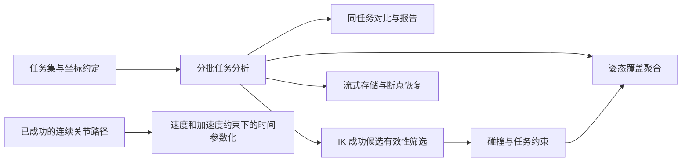

# 新功能分析与路线图

日期：2026-09-05，第十一轮更新。依据本地源码和现有示例评估。
任意目标点/位姿的分批评估、任务权重、坐标变换、灵巧度门槛、任务秩检查和
JSON 报告已实现，见 [测试指南](reachability-testing.md) 与
[第五轮记录](optimization-2026-09-05-round5.md)。第六轮补齐离线质量重评、按位置
聚合姿态覆盖，以及带验收条件和报告的 [完整测试流程](testing-workflow.md)。
第七轮增加 [配对位姿扰动](robustness-testing.md) 和
[后续方案的验收依据](validation-options.md)。
第八轮增加 [固定姿态平移线段的边界细化](boundary-testing.md)，含终点复查与
完整查询轨迹；完整区域扫描仍属后续范围。
第九轮增加 [多初值与求解预算稳定性分析](stability-testing.md)，保留逐项改善、
退化、质量变化和显式初值，支持保存后离线重评。
第十轮增加 [已测候选质量选择](candidate-selection.md)，保留目标来源、选择时的
门槛和指标取舍，支持选后质量验收及重新选择。
第十一轮增加 [关节初值生成与配置多样性](candidate-diversity.md)，保存自动生成
的初值，按关节容差报告新增配置与重复候选，并保留全部测量参与质量选择。
以下明确标注已完成部分和后续提案。

根据进一步扩展机器人可达性与灵活性测试的需求，建议下一阶段在现有多姿态
统计上增加通用姿态采样和展示，并将线段细化扩展到区域边界扫描和多 IK 分支质量搜索。
这些能力可直接复用已完成的目标评估接口。通用多模型对比、碰撞与流式恢复仍有
价值，但无需阻塞测试能力本身的迭代。

## 现有能力与缺口

| 方向 | 已有能力及源码入口 | 尚缺的能力 |
| --- | --- | --- |
| 运动学 | `kinematics.py`：NumPy/Torch 批量 FK、Jacobian、多起点和补救 IK | 每次求解最终只保留一个配置；内部重启候选尚未全部暴露 |
| 工作空间 | `analyzer.py`：关节与包围盒采样；`reachability.py`：目标评估和离线质量重评；`coverage.py`：显式位置 ID 分组的姿态覆盖 | 通用稳定目标 ID、逐目标容差、自动姿态分组、全局姿态采样与展示 |
| 任务示例 | `plane_reachability.py` 平面扫描；`trajectory_gallery.py` 轨迹 | 平面仍是特定机械臂命名的示例；核心 `CartesianConfig` 已支持平面、线段与固定点；区域自适应细化仍待实现 |
| 扰动测试 | `robustness.py`：确定性单轴平移/旋转、配对 IK/质量统计、最差成功指标和验收报告 | 组合误差、多幅度曲线、实际安装误差分布 |
| 边界测试 | `boundary.py`：固定姿态线段二分、成功端初值、最终失败端复查、预算与精度状态 | 区域粗扫描、多区间发现、质量边界和区域可视化 |
| 稳定性 | `stability.py`：固定目标的初值与预算比较；`selection.py`：质量选择；`diversity.py`：初值生成及容差分组 | 定向候选生成、停止条件和更大任务集的增量存储 |
| 机械臂对比 | `compare_w1_marvin.py`：对齐、占据体素、凸包、共用目标与报告 | 通用多模型 API、可复用指标、统一数据导出、明确的配对比较口径 |
| 有效性 | 关节范围、IK 残差、灵巧度、任务秩、候选质量选择及轨迹连续性 | 定向质量搜索、自碰撞、环境碰撞、距离余量与姿态区域约束 |
| 大规模运行 | 分批计算、取消、进度、完整结果 NPZ 缓存 | 样本仍整体生成；无增量输出、断点续算或批大小无关的 IK 随机种子分配 |
| 轨迹 | `trajectory.py`：连续求解、闭环修正、速度/加速度诊断 | 约束下重新分配时间；模型只解析速度上限，没有加速度上限输入 |
| 验证 | `make check`、机器人验收报告、NumPy 核心与 Torch CPU/SciPy/Viser CI 作业配置 | 远程 CI 需在提交后执行；CUDA 仍需有设备的测试环境 |

“IK 未找到解”与“数学上不可达”需要区别；当前可达率是给定采样和求解预算下的
数值结果。没有碰撞检查时，该指标也不能称为无碰撞可达率。

## 优先级与投入

以下为熟悉项目的一名开发者的初步工程估算，包含回归测试和文档，不是排期承诺；
真实机器人模型质量、可选库适配和场景复杂度可能明显增加投入。各行存在依赖，
不能直接把估算相加当作完成日期。

| 优先级 | 功能 | 用户收益 | 最小可用范围 | 估算 |
| --- | --- | --- | --- | --- |
| 已有基础 | 通用目标评估 | 测试真实抓取点、装配位姿、平面扫描 | 点/位姿、坐标变换、权重、质量门槛与报告已完成；稳定 ID、逐目标容差尚缺 | 完善部分约 1–3 人日 |
| P0，部分完成 | 多姿态覆盖图 | 判断某位置能以哪些工具方向作业 | 已完成逐位置原始/加权 IK 与质量覆盖；尚缺通用方向采样、最佳配置、方向过滤与展示 | 剩余约 2–4 人日 |
| P0，部分完成 | 工作空间边界精细扫描 | 定位任务区域中的可达变化和质量退化区 | 已完成用户指定线段的区间细化和数值状态；尚缺区域粗网格、多区间发现、质量边界 | 剩余约 2–4 人日 |
| P0 | 通用工作空间对比与报告 | 同一任务下比较机械臂、安装位置和参数 | 共用目标、覆盖率、共同/独有目标、体素统计、JSON/Markdown | 3–5 人日，复用任务集 |
| P1，部分完成 | 扰动鲁棒性测试 | 评估目标偏差和安装误差下的任务稳定性 | 已完成确定性单轴扰动、配对评估及最差成功质量；尚缺组合误差和多幅度统计 | 剩余约 2–4 人日 |
| P1，部分完成 | 多 IK 分支质量搜索 | 寻找同一目标更灵活、限位余量更大的配置 | 已完成均匀初值生成、配置分组、质量优先选择和来源追溯；剩余定向搜索与分支识别 | 剩余需单独评估求解器内部候选保留方案 |
| P1 | 碰撞与任务约束 | 识别 IK 有解但与自身或环境干涉的目标 | 候选有效性协议、一个碰撞后端、静态障碍物、明确失败原因 | 8–15 人日，依赖碰撞模型可用 |
| P1 | 流式分析与断点续算 | 支持长时间、大样本实验 | 增量随机采样、磁盘结果、检查点、严格恢复校验 | 5–10 人日；先支持随机采样 |
| P2 | 轨迹时间参数化 | 依据速度/加速度限制生成时间轴 | 显式限制、可选时间参数化后端、超限与路径误差复核 | 4–7 人日，不含动力学 |

## 已完成的目标评估与后续通用对比

`WorkspaceAnalyzer.analyze_targets` 与 `ReachabilityConfig` 已支持 `(N, 3)` 点、
`(N, 4, 4)` 位姿、任务权重、显式坐标变换、分批求解、取消及缓存；CLI 已支持
无表头 XYZ CSV、NPY、NPZ 和 JSON 报告。完整目标位姿保存在可选
`AnalysisResult.target_poses` 中，旧 NPZ 文件仍可加载。结果区分 IK 成功与选中
配置通过质量要求，包含独立的平移和旋转误差、任务秩及质量分位数。

后续可增加 `tasks.py`，集中管理稳定目标 ID、输入来源、逐目标容差和姿态分组，
并使平面网格生成器直接输出相同任务描述。当前固定行顺序并不等于跨文件稳定的
目标 ID；现有求解器配置使用统一容差，也尚未支持逐目标约束。姿态聚合现已
接受显式位置 ID，但尚未形成上述完整任务描述。

`AnalysisResult.reassess_quality` 可从已保存的测量重新判定质量；修改门槛和任务
权重时缓存不再重跑 IK。`examples/reachability_workflow.py` 生成已知 FK 目标、
确定范围外目标和工具 X 轴局部正负偏移姿态，保存逐目标数据、分组覆盖和门槛
扫描，并以明确退出码表达验收结果。局部三姿态测试不替代全局姿态采样。

`analyze_ik_stability` 已能对同一目标集比较多组初值和预算，并保存各组返回配置。
Marvin 有限边界测例中 IK 分类一致，但某成功目标的关节余量随配置明显变化，
第十轮已实现 [已测候选质量筛选](candidate-selection.md)，并保留按各向同性选择
时关节余量可能下降的取舍。不同策略共用原始测量，不因改变排序指标重算 IK。
第十一轮通过均匀初值生成及容差分组，区分成功试验次数和观察到的配置组数；
配置组不是全部分支枚举，且不会删除接近门槛两侧的候选。

质量判定目前只检查每组已选中的 IK 配置，尚未自动选择跨组更高质量的分支。`task_rank`
也只是局部雅可比性质，不能单独证明可完成一段连续任务或无碰撞轨迹。

在 `comparison.py` 提取对比示例中通用的体素与报告逻辑。首期采用用户给出的
共同坐标系和固定体素边长，拒绝坐标单位不一致的输入。报告至少包含：

- 相同目标 ID 下的各模型成功率、加权覆盖率、两者均成功和各自独有成功的数量。
- 成功配置的质量分位数及失败目标的残差分布；报告分母、筛选阈值和求解预算。
- 体素交集/并集、边长和采样策略，明确这是采样占据估计；凸包会包住空洞，不能
  用作真实可达体积。共面点的三维体积为零，面积需要单独定义。
- JSON 原始统计与 Markdown 可读报告。先支持任意两个模型，再增加多模型矩阵。

现有示例的 Wilson 区间不应直接扩展成所有对比的统计保证。共用目标形成配对样本；
独立随机任务可考虑按目标做配对重采样评估差异，而均匀网格、QMC 和自适应采样
不能默认套用独立伯努利抽样的解释。

验收：带旋转和平移的同一任务在不同输入坐标系下得到一致目标；输入顺序和 ID
完整保留；一目标尾批次、空成功集、全部成功、不同任务权重均可解释；同一模型
与自身对比时独有目标数为零；两个不相交的合成体素集合重叠率为零。

## 建议新增的边界、鲁棒性与分支测试

本轮已实现固定姿态平移线段的成功/失败区间细化，使用解析立方体和二连杆外边界
验证，并对最终失败端点使用最新成功配置作初值复查。结果只表示本次预算下的
数值区间，不保证找出全部变化或最外边界。

后续区域扫描从用户指定平面或三维区域的粗网格开始，在 IK 结果或质量等级变化的
相邻单元继续细分。必须保留空间分辨率和计算预算；数值 IK 未收敛应标记为未找到
解，并对候选边界加大补救预算，不能将每次求解失败直接视为几何边界。解析三轴
平移机构的立方体边界和二连杆的圆形外边界适合作为确定性验收基准。只有明确
停止分辨率后，才比较边界误差和目标调用次数。

扰动测试已覆盖已知幅度 XYZ 平移和三轴旋转，每个参考保留确定性变体顺序，输出
配对变化、全部变体通过率及成功配置中的最差质量。已用解析边界、零扰动退化、
工具轴换基一致性和缓存重评验证。下一步可增加组合位姿误差、多幅度与安装误差
模型；仍须区分等权样本比例和真实误差分布下的概率，不应复用单轴采样的解释。

已测候选现可离线按质量优先级选择，解析双分支和奇异反例已纳入回归。进一步
扩展多分支质量搜索，需要在 `_select_best` 之前或补救流程中保留并评估多个成功候选，
先确保满足任务误差，再按质量约束和用户优先级筛选。必须区分“本次搜索中最好”
与全局最优；仅反复改变随机种子不能保证覆盖所有分支。验收应构造同一目标有
两个 IK 解、一个靠近限位而另一个余量更大的案例，验证原始可达率不降低且能
选择满足门槛的候选。这也为后续碰撞候选筛选提供基础。

## 第二阶段：碰撞约束和姿态覆盖

### 碰撞与有效性

增加可选的批量配置检查协议，例如 `validate(q_batch, scene)` 返回有效性、
原因码和后端支持时的距离。先用简单确定性检查器验证流程，再接一个实际碰撞
后端。保持 NumPy 核心可独立安装；MoveIt 可作为有 ROS 环境时的适配方案，
不作为核心强制依赖。其 PlanningScene 已有自碰撞、环境碰撞、允许碰撞对和约束
检查机制，可参考这些职责划分。[MoveIt Planning Scene 官方教程](https://moveit.picknik.ai/main/doc/examples/planning_scene/planning_scene_tutorial.html)

当前 `model.py` 没有保存 URDF `<collision>` 几何；Viser 的 `<visual>` 网格也不能
直接当作等价碰撞模型。接入需要处理碰撞几何、mesh scale、资源路径、工具、
非求解链关节的姿态和障碍物变换。允许碰撞对必须显式配置；缺失几何不能默认为
“检查通过”。场景、几何内容和检查器配置必须加入缓存标识；无法稳定标识的外部
检查器应禁用结果复用。

特别需要调整 IK 的候选选择：如果先只保留最优 IK 配置再检查碰撞，可能丢掉
同一目标的另一个无碰撞解。应在成功候选选择阶段加入检查，或仅对尚未找到有效
配置的目标继续补救。候选可按批处理和即时筛选，避免保存所有重启的所有结果。
预算耗尽的状态应表达为“已搜索候选均无有效解”，不证明所有 IK 分支都有碰撞。

验收：一个目标有两个已知 IK 分支，首选分支碰撞、另一分支有效时能返回有效解；
没有检查后端时输出“未检查”；场景变化使缓存失效；全部候选失败时保留具体原因。
此阶段只验离散配置，连续轨迹段的碰撞需要另外检查。

### 姿态覆盖图

已完成：`AnalysisResult.orientation_coverage(position_ids)` 按显式位置 ID 汇总
样本数、IK/质量通过数，以及原始和加权覆盖率；支持交错分组、位置一致性检查、
零权重组和严格 JSON。重复姿态按输入次数计数。

后续让每个位置对应通用方向集合，补充质量分布和最佳配置。支持
全姿态集合与任务给定方向/倾角范围；区别工具轴方向（球面）和完整旋转（SO(3)）。
完整旋转不要以均匀 Euler 角替代均匀 SO(3)；SciPy `Rotation.random` 提供
Haar 均匀旋转采样，可作为可选实现。适配时需兼顾项目当前 SciPy 最低版本与
新版随机数参数名称变化。[SciPy Rotation.random 官方文档](https://docs.scipy.org/doc/scipy/reference/generated/scipy.spatial.transform.Rotation.random.html)

下一步实现固定数量、固定种子的方向集，并使用稳定的 `(position_id, orientation_id)`
分批求解。比如 10 万位置乘 64 姿态已有 640 万任务，不能再整体展开重启维度；
覆盖计数和质量摘要应增量聚合，详细配置按需存储。64 个姿态下一个成功计数就
改变 1/64 的覆盖率，需要报告方向数量及抽样范围。

验收：已知可达旋转能被计入；不合任务方向的姿态被剔除；重复运行一致；未执行
碰撞检查的覆盖图明确标为 IK 覆盖，不能混为无碰撞覆盖。覆盖图描述有限采样集，
不是对所有姿态的证明。

## 第三阶段：规模化与轨迹应用

### 流式分析与恢复

增加批次迭代器和结果写入接口，首期从随机采样、磁盘 `.npy`/memmap 与 JSON
检查点开始。保留现有完整 NPZ 作为便捷导出，避免压缩 NPZ 被误用为可原地追加的
数据库。检查点记录已提交区间、采样器状态、任务/模型/求解器摘要、数据格式和
后端版本，完成批次后再原子更新检查点。

必须将目标种子从当前“每次 IK 调用重新启动随机数生成器”的方式改为稳定目标
ID 派生，使恢复和更换批大小不改变候选分配。跨 NumPy/Torch 或设备只要求指定
数值容差内一致，不承诺浮点位级一致。第一版不应声称所有采样器均可任意续接：
LHS 依赖总样本设计，Sobol 需要保持序列和采样规则；这些策略应单独定义恢复语义。

验收：中断后恢复与相同配置的一次完成结果一致，且没有重复/缺失目标；损坏批次
被发现；模型或场景变更时拒绝恢复；固定批大小增加总样本量时，计算工作内存不会
按完整样本数组增长。测内存时需区分进程工作集与操作系统磁盘页缓存。

### 时间参数化

在轨迹几何求解之后增加可选 retime 步骤，输入显式关节速度和加速度限制、起止
条件，输出时间戳、位置、速度、加速度。TOPPRA 官方示例支持给定路径上的关节
速度及加速度约束，可作为后端候选。[TOPPRA 官方 Quickstart](https://hungpham2511.github.io/toppra/quickstart.html)

当前解析模型只有速度上限，加速度必须由调用者提供；缺失值不应静默猜测。只对
连续且求解成功的路径段工作，并检查插值后的关节范围、任务误差和需要时的碰撞。
经过原始 IK 路点的样条不一定在路点之间保持原来的笛卡尔路径约束。首期不包含
力矩、负载、jerk 限制或硬件执行接口。

验收：加密检查后的速度和加速度符合输入限制及数值容差；失败段明确拒绝或分段；
缩紧限制不会被忽略；重复路点、连续关节展开和单点路径有清晰行为。

## 依赖顺序与暂缓项

基座位置优化可以在任务覆盖评分稳定后引入，目标函数包括覆盖率、质量阈值和
安装范围；在此之前做优化容易得到无法解释的“最优”位置。双臂协调、mimic 联动、
全身运动学和学习型可达性预测涉及更大模型或验证范围，建议暂缓。

已配置可选运行时独立 CI 作业，并保留只依赖 NumPy 的运行时矩阵，均上传 JUnit
和机器人报告。本轮本地运行不能替代远程 CI 执行；CUDA 应在确有设备的环境单独验证。
