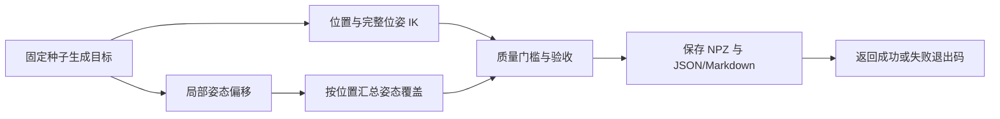

# 可重复执行的机器人测试流程

流程分为两层：机器人评估生成可检查的数据和报告；开发回归检查实现、依赖和
打包是否正常。所有仓库内基准均可使用自带 URDF，不依赖外部机器人资产。

## 一条命令运行开发检查

```bash
python -m pip install -e '.[dev]'
make check
```

依次执行代码检查、完整 pytest 回归、三轴平移机构测试流程和源码包/wheel 构建。
可以分别运行 `make test`、`make test-workflow`、`make lint`、`make build`。
解析机构流程默认在 Make 入口启用配对扰动、平移边界验收、多预算/随机种子稳定性测试
和已测候选解的质量选择，同时增加 2 个显式初值及配置多样性报告。
pytest 结果保存在 `outputs/test-results.xml`，机器人流程报告保存在
`outputs/test-workflow/report.json` 与 `report.md`。

最小环境只安装 NumPy 运行时，Torch/SciPy/Viser 测试会明确显示跳过。
CI 另有可选运行时作业，安装 Torch CPU、SciPy、Viser 和 trimesh，先验证导入与
本地端口，再运行测试及 Torch 机器人流程。核心 Python 3.10/3.12 和可选作业均
上传 JUnit 与机器人报告。外部 Marvin 资产缺失时，其专项测试允许跳过。

## 对实际机器人执行同一流程

```bash
PYTHONPATH=src python examples/reachability_workflow.py \
  --urdf /path/to/robot.urdf --base-link left_arm_base --tip-link left_ee \
  --backend numpy --samples 16 --batch-size 16 --seed 77 \
  --min-isotropy 0.05 --min-joint-limit-margin 0.1 \
  --output-dir outputs/my_robot_run
```

使用 `--backend torch --device cpu` 检查 Torch CPU；使用 CUDA 时先确认本机有
对应运行环境。更换机器人、求解器版本或参数做对比时，建议使用不同输出目录。



目标生成和检查规则：

| 阶段 | 数据与判定 |
| --- | --- |
| 已知可达目标 | 在关节中位附近采样配置，用 FK 得到目标；IK 从默认初值搜索，未把答案配置作为初值传入 |
| 确定范围外目标 | 根据串联链固定平移长度和棱柱关节位移上限计算保守半径，在六个轴向生成半径外目标；应全部被拒绝 |
| 位置测试 | 对已知目标和范围外目标施加位置约束，保存关节解及误差 |
| 完整位姿测试 | 对同一组目标施加位置和方向约束，保存独立旋转误差 |
| 局部姿态测试 | 每个已知位置测试参考姿态、工具局部 X 轴正/负旋转，默认 ±15°；参考姿态应达到已知目标成功率要求 |
| 质量扫描 | 对局部姿态结果重新应用若干关节余量门槛，不重新执行 IK/FK/Jacobian |
| 配对扰动，可选 | `--robustness-test` 对每个参考增加 XYZ 单轴位移与三轴旋转，比较参考和变体的 IK/质量状态 |
| 边界细化，可选 | `--boundary-test` 沿基座 X 正方向寻找成功/失败区间，批量二分并复查最终失败端点 |
| 稳定性，可选 | `--stability-test` 固定目标集，交叉比较预算与随机种子，保留逐项改善/退化与质量变化 |
| 候选选择，可选 | `--select-ik-solutions joint_limit_margin` 从稳定性候选中按质量门槛与指标选择配置，保留每行来源 |
| 初值与多样性，可选 | `--stability-initial-guesses K` 增加固定初值；`--candidate-diversity` 统计每组新增配置与重复候选 |

`--joint-fraction` 默认 0.12，控制相对关节总范围的采样半宽；
`--orientation-offset-deg` 控制局部姿态偏移。三种姿态只构成局部测试集，
不能表示完整 SO(3) 覆盖或全工作空间覆盖。

完整扰动测试使用 `--robustness-test --perturb-translation-m 0.01
--perturb-rotation-deg 5`，每个参考最多 13 个目标。报告方向敏感性、配对通过变化
和成功配置中的最差质量；可通过 `--min-robust-rate` 验收参考及全部变体均成功
的任务占比。分母、零扰动和坐标约定见 [扰动测试指南](robustness-testing.md)。

边界流程使用 `--boundary-test --boundary-distance-m 2`，默认分辨率为 0.1 mm、
最多 16 轮二分。启用后要求所有参考均形成有效区间并达到分辨率；未形成区间或
停止于预算/精度限制时验收失败，保留具体状态。见 [边界测试指南](boundary-testing.md)。

稳定性默认比较普通位姿目标，也可设置 `--stability-targets perturbations` 或
`boundary` 复查相应用例。`--max-ik-disagreement` 可限制分歧目标占比；稳定失败
不计为分歧，因此该指标应结合已知目标成功率解读。见 [稳定性测试指南](stability-testing.md)。

候选选择不修改原始试验；`--min-selected-quality-rate` 可验收整个所选目标集的
质量通过率，分母包含失败及范围外目标。原有各项验收仍生效。
详见 [候选解选择指南](candidate-selection.md)。

显式初值在全部预算/种子组合间配对复用，多样性分组使用独立的弧度和米容差。
分组不删除候选，也不把配置组数量解释为全部分支数。
见 [初值与多样性指南](candidate-diversity.md)。

## 验收与退出码

默认要求位置、完整位姿以及局部姿态组中的参考姿态，对已知 FK 目标均达到
`--min-known-success 1.0`，且位置/位姿测试中的六个范围外目标全部被拒绝。
可以显式设置较低的已知目标成功率，报告会同时记录要求与实际结果。

质量门槛默认用于诊断；若它也是应用验收要求，增加 `--min-quality-rate 0.8`，
要求位置与完整位姿测试中至少 80% 的**已知 FK 目标**通过质量门槛。
分母包含 IK 失败的已知目标，不包含故意构造的范围外目标。

- 退出码 0：全部已配置的验收条件通过。
- 退出码 1：至少一个验收条件失败；仍保存目标、结果和报告。
- 退出码 2：参数、输入或环境配置错误，控制台输出具体原因。

报告中的 `checks` 用于自动化验收；`cases`、`orientation_coverage` 和
`quality_sweep` 用于诊断。质量不佳的 IK 分支、数值求解预算不足和超出运动学
范围分别解释，不能用一次 IK 失败证明一般目标在数学上不可达。

## 产物与复现

| 文件 | 用途 |
| --- | --- |
| `targets.npz` | FK 原始配置、已知位姿、范围外目标、局部姿态目标与位置 ID |
| `position.npz` | 位置测试的逐目标结果 |
| `pose.npz` | 完整位姿测试的逐目标结果 |
| `local_orientations.npz` | 局部多姿态测试的逐目标结果 |
| `perturbation_targets.npz`、`perturbations.npz` | 启用扰动时的任务集和逐目标结果 |
| `boundary/` | 启用边界测试时的测量、查询轨迹和逐线段报告 |
| `stability/` | 启用稳定性测试时的逐组结果、显式初值和配对比较报告 |
| `stability/selected.npz` | 启用候选选择时的选定配置、每行来源试验索引和选择时的审计快照 |
| `stability/diversity.json` | 启用多样性分析时的关节容差、代表配置索引及每组新增/重复统计 |
| `report.json` | 配置、验收条件、结果摘要、姿态覆盖与门槛扫描 |
| `report.md` | 可读的测试摘要和每项验收状态 |
| `cache/` | 内容寻址的求解及灵巧度测量结果 |

重复同一命令时会重新构造相同测试输入，并复用测量缓存。修改质量阈值或任务
权重只重新统计；修改目标、初值、运动学模型、求解设置或 Jacobian 行权重时
重新测量。固定 batch size 和目标顺序是复现重启候选的必要条件。

完整目标评估和离线重评 API 见 [可达性与灵巧度测试指南](reachability-testing.md)。
本流程没有碰撞检查，质量门槛仍针对已经选中的 IK 配置。
更多可引入的方案及验收标准见 [验证方案分析](validation-options.md)。
